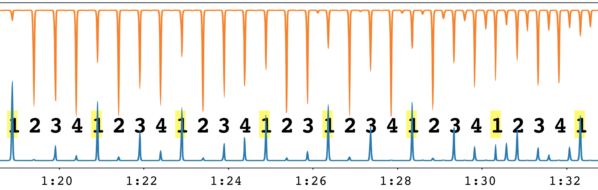
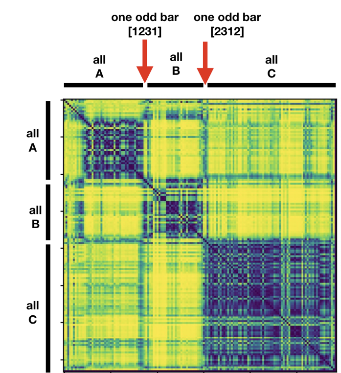
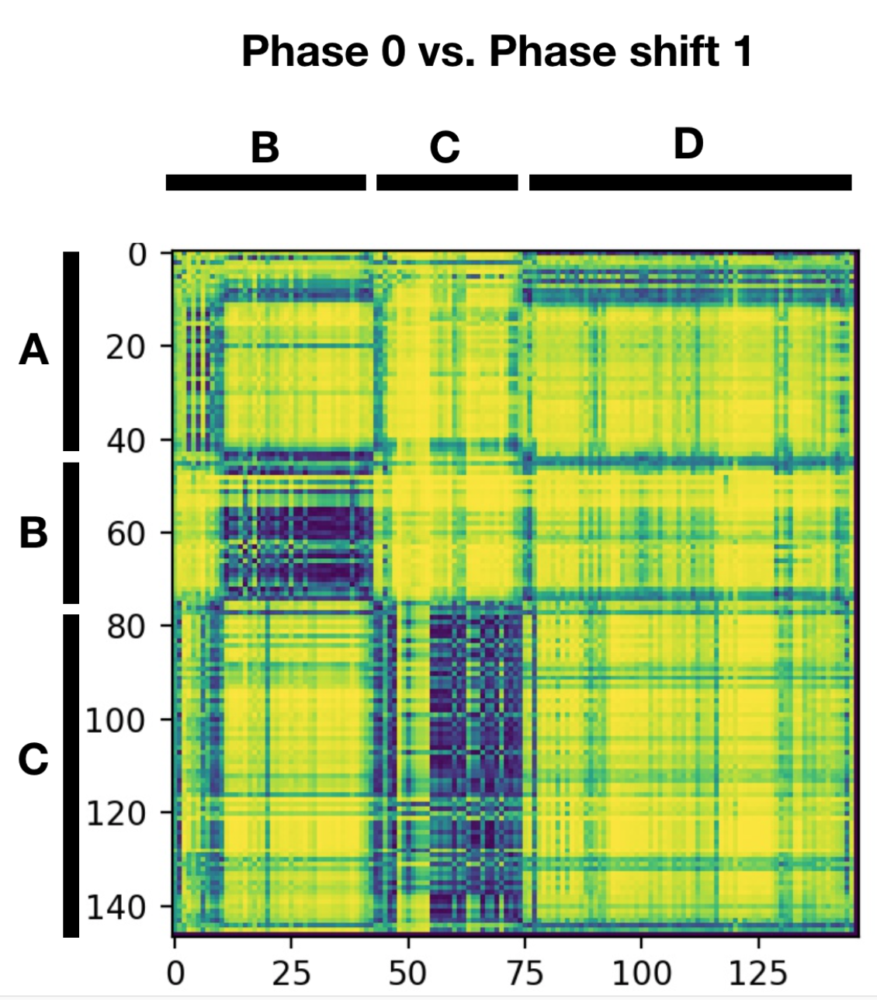
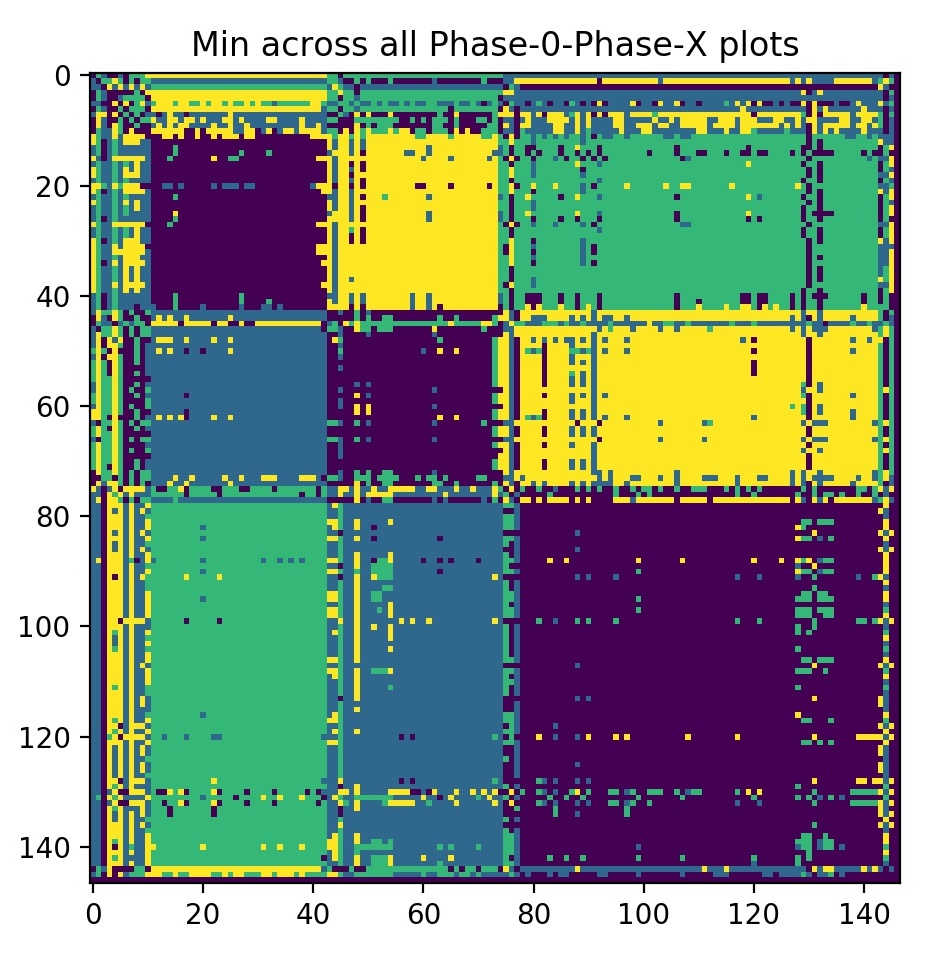

# Modelling odd meters
*2018 HAMR project on discovering and handling situations that lead to downbeat errors*

Refer to the [pdf presentation](https://github.com/jblsmith/hypermeter/blob/master/presentation_deadline_export.pdf) for detailed explanation.

## Goal
Detect time signature changes

- "Lucy in the Sky with Diamonds" (The Beatles): the song alternates between verses in 3/4 time and choruses in 4/4.
  - Bar lengths: 3, 3, 3, 3, ..., 3, 3, 4, 4, ... 4, 4, 3, 3, ..., 3, 3, 4, 4, ...
- "Hey Ya!" (Outkast): the time signature is 4/4, but in every 6-bar phrase, the 4th bar is cut short.
  - Bar lengths: [4, 4, 4, 2, 4, 4], [4, 4, 4, 2, 4, 4], [4, 4, 4, 2, 4, 4], ...
- "The Stars" (Jukebox the Ghost): time signature is 4/4, but there are two beats missing in the entire song.
  - Bar lengths: 4, 4, 4, 4, 4, ..., 4, 4, 3, 4, 4, ..., 4, 4, 3, 4, 4, ..., 4, 4, 4.

These unusual situations are likely to lead to beat- or downbeat-tracking errors.

These types of situations are not rare; in a corpus of 180 Beatles songs,
56 annotations have bars of non-uniform length.

## Problem

It's easy to track a typical beat sequence:
```
     1  2  3  4  1  2  3  4  1  2  3  4  1  2  3  4  ...    <- true beats
    [1  2  3  4][1  2  3  4][1  2  3  4][1  2  3  4] ...    <- downbeat groupings
```

Naive beat tracking on a unusual beat sequence leads to "phase" errors:
```  
     1  2  3  4  1  2  3  4  1  2  3  1  2  3  4  1  2  3  4  1  ...    <- true beats
    [1  2  3  4][1  2  3  4][1  2  3  1][2  3  4  1][2  3  4  1] ...    <- naive downbeat groupings
    [1  2  3  4][1  2  3  4][1  2  3][1  2  3  4][1  2  3  4][1  ...    <- true downbeat groupings
```

How can we detect these situations and correct the detected downbeats?

## Detecting meter changes

Let's look at a real example of the above situation (i.e., a 4/4 song with an isolated bar of 3/4), using an excerpt of "The Stars" by Jukebox the Ghost. The output of the downbeat detection function (DDF) estimated by Madmom seems to reflect the true meter accurately, taking maximum values at each downbeat, even when the meter changes for a bar around 1:24-28. (The DDF is the blue line; the beat detection function has been inverted and is the orange line at top. The true beat labels are printed with the downbeats highlighted in yellow.) That said, the DDF does miss the downbeat at 1:30, but this is due to the syncopation in the music, not a change in meter.

<a href="the_stars_ddf.png"></a></div>

Hypothesis: by comparing windowed excerpts of Madmom's DDF (and/or other features, perhaps) with different phase offsets, we can expose the meter anomaly. Intuitively, if a non-zero phase offset gives the best similarity match between two bars, then a meter anomaly has occurred.

Continuing with the same motivating example, suppose we naively group the detected beats into bars, assuming a fixed 4/4 time signature, but with all possible phase offsets. We would get:

```  
     1  2  3  4  1  2  3  4  1  2  3  1  2  3  4  1  2  3  4  1  2  3  4  ...    <- true beats
    [1  2  3  4][1  2  3  4][1  2  3  1][2  3  4  1][2  3  4  1] 2  3  4  ...    <- naive downbeat groupings, offset 0
     1 [2  3  4  1][2  3  4  1][2  3  1  2][3  4  1  2][3  4  1  2] 3  4  ...    <- naive downbeat groupings, offset 1
     1  2 [3  4  1  2][3  4  1  2][3  1  2  3][4  1  2  3][4  1  2  3] 4  ...    <- naive downbeat groupings, offset 2
     1  2  3 [4  1  2  3][4  1  2  3][1  2  3  4][1  2  3  4][1  2  3  4] ...    <- naive downbeat groupings, offset 3
```

Now replace every [1 2 3 4] with A, [2 3 4 1] with B, [3 4 1 2] with C and [4 1 2 3] with D:

```  
     1  2  3  4  1  2  3  4  1  2  3  1  2  3  4  1  2  3  4  1  2  3  4  ...    <- true beats
    [     A    ][     A    ][1  2  3  1][     B    ][     B    ] 2  3  4  ...    <- naive doDnbeat groupings, offset 0
     1 [     B    ][     B    ][2  3  1  2][     C    ][     C    ] 3  4  ...    <- naive doDnbeat groupings, offset 1
     1  2 [     C    ][     C    ][3  1  2  3][     D    ][     D    ] 4  ...    <- naive doDnbeat groupings, offset 2
     1  2  3 [     D    ][     D    ][     A    ][     A    ][     A    ] ...    <- naive doDnbeat groupings, offset 3
```

If we directly compare any two windows labelled A, they should be similar, because the location of beats and downbeats within them is similar. However, if we compare A with B, they will be dissimilar.

If we construct a self-similarity matrix (SSM) out of the first sequence, we expect to find big blocks on the diagonal when things stay in phase (all A=A, all B=B), but sharp corners when a meter anomaly shifts things out of phase (A≠B). We can see this situation below.

<a href="the_stars_mat0.png"></a></div>

But does the sharp corner truly indicate a meter anomaly, or just a strong change in the rhythm? Either could be true---we saw already that syncopation can strongly affect the DDF. We can clarify the situation by creating a cross-similarity matrix (CSM) between naive downbeat groupings with different offsets, like the one below that compares offset = 0 with offset = 1. Here, each off-diagonal block indicates that two parts of the song, which seemed different according to the previous matrix, are actually similar if a phase shift is taken into account.

<a href="the_stars_mat1.png"></a></div>

If we compute all 4 similarity matrices (one SSM, three CSMs), and take the argmin across them, we can neatly visualize the pattern of phase changes throughout the piece:

<a href="the_stars_matmin.jpg"></a></div>

The clear visualization hints that it should be possible to detect these situations automatically, but doing so, and actually correcting the tracked downbeats, remain open problems.

## Estimating correct downbeats

We start from the same DDF, and try to directly infer the temporal positions of downbeats, through peak picking based on thresholds and particular rules.

This idea has been only experimented on particular pieces of music so far, and will be explained on those particular examples.

### Hey Ya

We select the peaks of amplitude higher than 0.33. We get a first estimation of downbeats. This shows that we have series of two 4-beat bars, one 6-beat bar, and two other 4-beat bars, this repeated again and again.

The problem is that sometimes, instead of finding the 6-beat bar, we find a succession of 4-beat and 2-beat bars. This shows the limitation of a global thresholding (set to 0.33 above).

The strategy then is to try to find heuristics, as general as possible, that could help detecting that 6-beat bars and 4-beat bar followed by 2-beat bars can be considered as the same thing.

The proposed heuristic is: let’s suppose we have a succession of N-beat bars, followed by a single M-beat (with M<N), and then followed by a another sequence of bars, then the smaller bar is fused to one of the two neighbour bars. We select the neighbour bar where the DDF value in between is the lower, indicating that the separation between the two bars is the most ambiguous.

(We compute the difference between successive downbeats, expressed in number of beats. For this, we need the temporal beat grid: we suppose constant tempo and find the inter beat duration as the temporal distance between the two first peaks found in the detection function (using a peak picking with no absolute threshold but a contrast threshold of 0.01).)

Using this heuristics, we obtain a clearer structure of the song.

### Love Is All

The threshold for peak picking is set to 0.2.

Without the heuristics, we get the desired structure.

The heuristics provokes an incorrect fusion at the transition between 4-beat and 3-beat bars.
